# ICC Test Protocol — 표준 시나리오 · KPI · 시뮬레이션 구현 계획

**ICC 정의**: Integrated Chassis Control — **종방향 · 횡방향 · 수직방향의 종합적인 샤시 제어**. 대상 서브시스템: ABS, ESC/VDC, AFS, CDC (반능동 서스), TVS/TC, EBD. 그들의 **통합 조율 (coordinator) 설계와 검증**이 핵심. ADAS 레이어 (AEB, ACC, LKAS — 인지/상위 의사결정)는 별건이며 본 프로토콜 범위 밖.

**Scope**: 제어기 설계 진입 전 ICC 검증을 위한 산업/규제 표준 시나리오 정리. 각 시나리오의 KPI 정의 + 현재 MATLAB 시뮬레이션 프레임워크에서의 구현 가능성 평가 + 단계별 구현 계획.

**참조 표준 (ICC 범위)**: ISO (3888, 4138, 7401, 7975, 8608, 14512, 19365, 21994, 2631), UN-R 13H/79, NHTSA FMVSS 126, OEM 내부 ride 사양.

---

## 1. 시나리오 분류

ICC는 다음 4축으로 검증한다. **종/횡/수직 + 통합** — 통합 카테고리(D)가 ICC의 본질적 검증.

- **Category A**: 횡방향 (ESC/VDC, AFS, TVS)
- **Category B**: 종방향 (ABS, EBD, TC) — **AEB/ACC 등 ADAS는 제외**
- **Category C**: 수직 (CDC, 반능동/능동 서스)
- **Category D**: **통합** (multi-axis simultaneous control — ICC 핵심 검증)

### Category A. 횡방향 (ESC / VDC / AFS)

| ID | 시나리오 | 표준 | 목적 |
|---|---|---|---|
| A1 | **DLC (Double Lane Change) at 80 km/h** | ISO 3888-1:2018 | 일반 핸들링, 차선 변경 능력 |
| A2 | **DLC severe / Moose test** | ISO 3888-2:2011 | 회피 기동, 한계 핸들링 |
| A3 | **Step Steer** | ISO 7401:2011 | 횡 transient 응답 (rise time, overshoot, settling) |
| A4 | **Steady-State Circular** | ISO 4138:2021 | 정상상태 understeer/oversteer 특성, ay-vs-δ 곡선 |
| A5 | **Sine with Dwell** | NHTSA FMVSS 126 / ISO 19365:2016 | ESC 인증 — Yaw rate 1초 후/1.75초 후 감쇠율 |
| A6 | **Sinusoidal Steer Sweep (Random)** | ISO 7401:2011 | 주파수 응답 (yaw rate gain, 위상) |
| A7 | **Brake-in-Turn** | ISO 7975:2019 | 통합 — 곡선 중 제동 시 안정성 |
| A8 | **J-Turn** | NHTSA NCAP | rollover 한계 평가 (SUV 위주) |

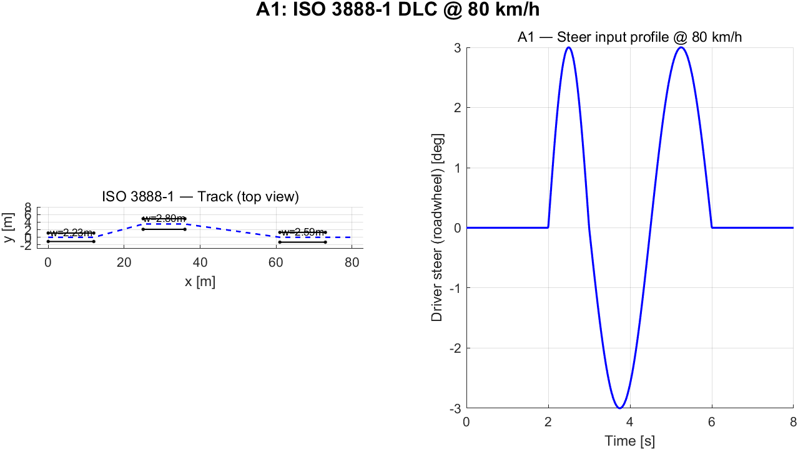
*Figure A1 — ISO 3888-1 DLC: 콘 배치 (12 m + 13.5 m offset + 12 m), 차선폭 1.1·b+0.25 ≈ 2.23 m; 운전자 조향 입력은 ±3° 사인 시퀀스.*

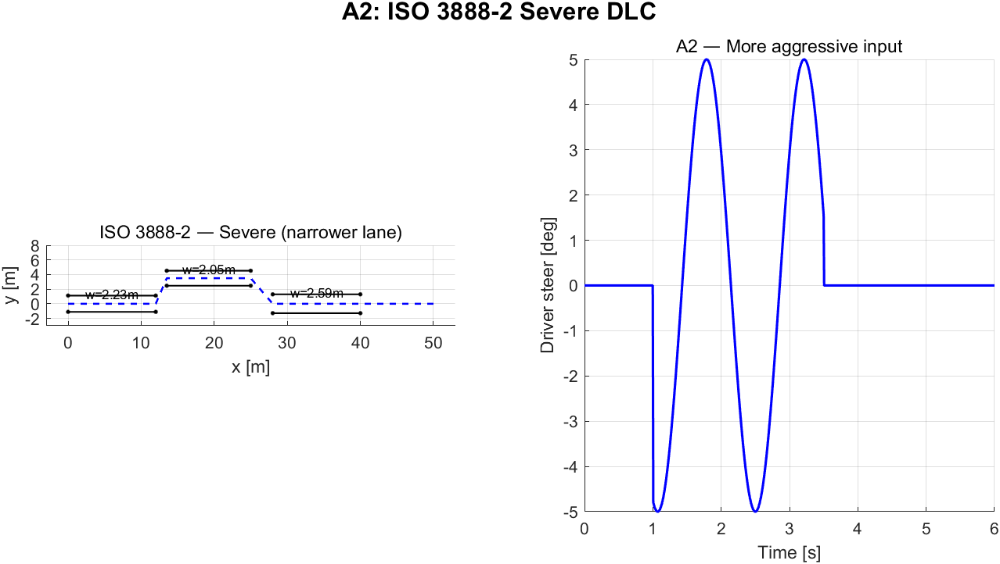
*Figure A2 — ISO 3888-2 (좁은 lane width로 회피 능력 강도 증가).*

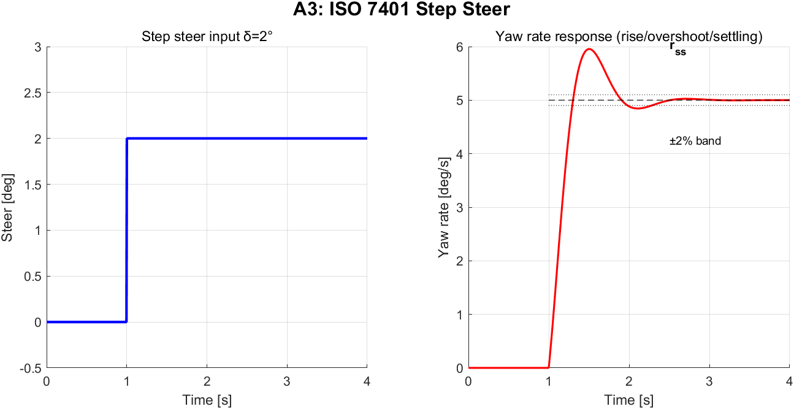
*Figure A3 — Step steer 입력과 yaw rate 응답: rise time (10–90%), overshoot, ±2% settling band.*

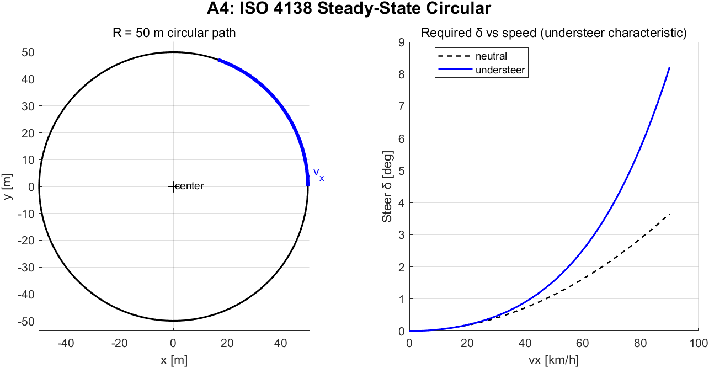
*Figure A4 — 정상상태 원선회 R=50 m; 속도 증가에 따른 δ 증가율이 understeer gradient.*

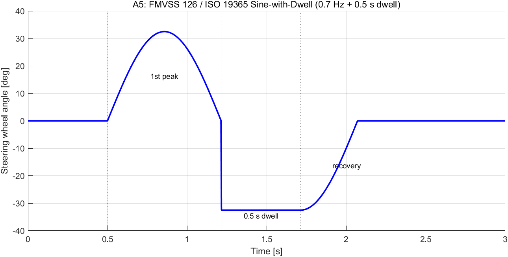
*Figure A5 — FMVSS 126 sine-with-dwell: 0.7 Hz sine + 0.5 s dwell at 2nd peak. ESC 개입 후 BOS+1.0/1.75 s 시점 yaw rate 측정.*

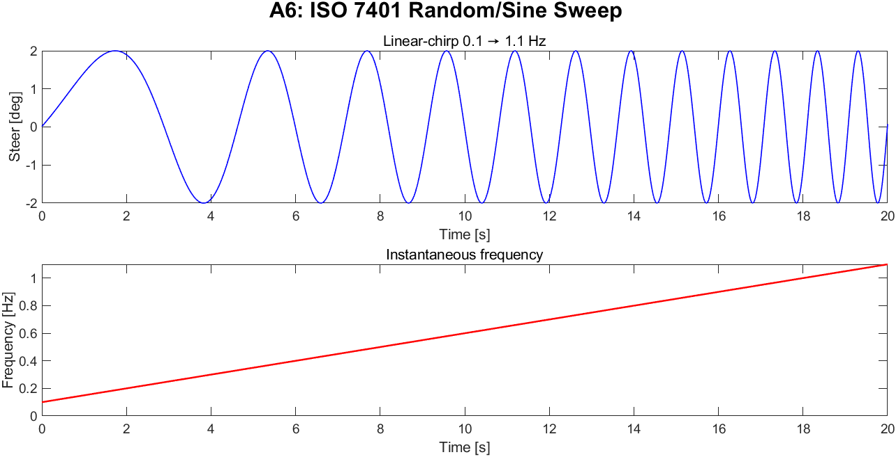
*Figure A6 — 선형 chirp 0.1→1.1 Hz 조향 sweep, frequency response (Bode) 분석용.*

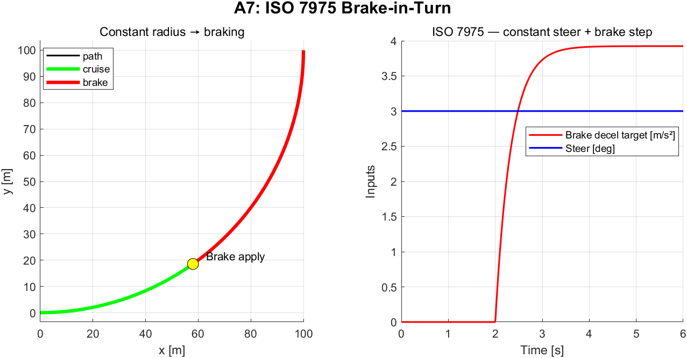
*Figure A7 — ISO 7975 Brake-in-Turn: 정상 선회 중 t=2 s에 0.4 g brake step 인가.*

### Category B. 종방향 (ABS / EBD / TC)

ICC 범위는 **샤시 레벨 제동/구동 제어**까지. AEB/ACC 등 ADAS (인지+계획) 검증은 별도 프로토콜로 분리.

| ID | 시나리오 | 표준 | 목적 |
|---|---|---|---|
| B1 | **Straight-Line Braking (고 μ)** | ISO 21994:2007, UN-R 13H | 제동거리, 제동 안정성 |
| B2 | **Straight-Line Braking (저 μ, 빙판)** | ISO 21994:2007 | ABS 효율, μ 활용도 |
| B3 | **Split-μ Braking** | ISO 14512:1999 | μ 비대칭 시 ABS + ESC 통합 (yaw 안정성) |
| B4 | **Brake Pedal Step** | OEM 사내 | 제동 transient (rise time, peak decel) |
| B5 | **Tip-in Acceleration on 저-μ** | OEM (TC 시험) | TC 휠 슬립 제한, ay carry-over |
| B6 | **Wheel Lift Recovery** | ISO 21994:2007 부속 | 한 휠 lift 시 ABS 거동 |

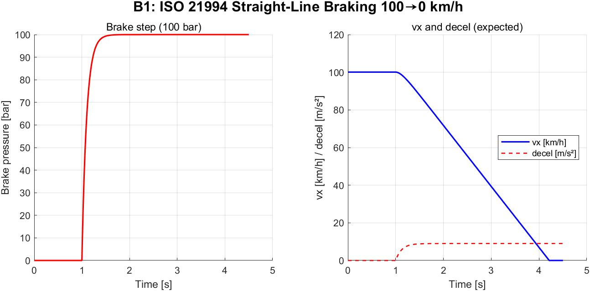
*Figure B1 — ISO 21994 직진 제동: 100→0 km/h, 100 bar 브레이크 step. KPI: stopping distance, MFDD, max jerk.*

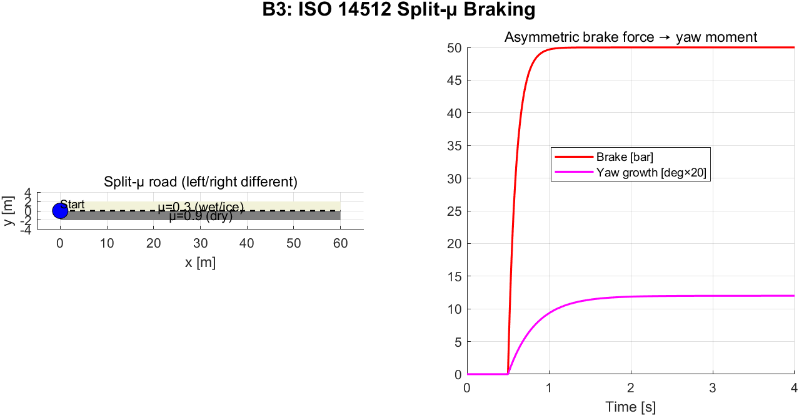
*Figure B3 — ISO 14512 split-μ: 좌/우 μ가 서로 다른 노면에서 직진 제동, 비대칭 brake force가 yaw moment 유발. ESC+ABS 통합 평가.*

### Category C. 수직 (CDC / Active Suspension)

| ID | 시나리오 | 표준 | 목적 |
|---|---|---|---|
| C1 | **Single Bump (Pothole)** | ISO 8608:2016, OEM 사양 | 충격 흡수, peak suspension travel |
| C2 | **Sinusoidal Sweep (0.1–25 Hz)** | OEM ride sweep | wheel-hop / body-bounce 분리 |
| C3 | **Random Road (Class A/B/C)** | ISO 8608:2016 | 노면 거칠기 따른 ride RMS |
| C4 | **Belgian Block / Cobblestone** | OEM endurance | 고주파 노면 |
| C5 | **Skyhook step (CDC)** | OEM | 댐핑 명령 transient |

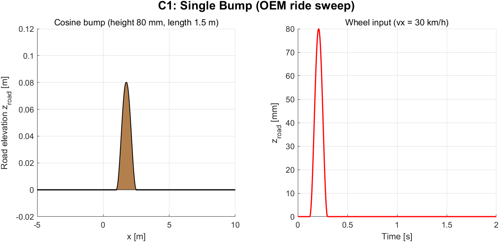
*Figure C1 — Cosine bump (80 mm 높이, 1.5 m 길이); vx = 30 km/h 통과 시 wheel 입력.*

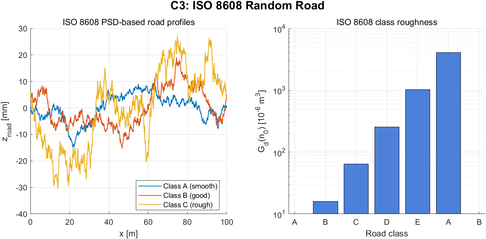
*Figure C3 — ISO 8608 PSD 기반 합성 노면 프로파일 (Class A/B/C). Gd(n₀) 값은 클래스 4배 간격 (A=16e-6, B=64e-6, ...).*

### Category D. 통합 / Integration (ICC 핵심)

종/횡/수직 동시 작동 시 coordinator의 충돌 해소와 안정성 검증. **ICC 설계의 핵심 검증 카테고리**.

| ID | 시나리오 | 표준 | 검증 대상 (통합) |
|---|---|---|---|
| D1 | **DLC under Braking @ 0.3g** | OEM combined | ESC+ABS+CDC 통합 — 조향+제동+서스 동시 |
| D2 | **Sine with Dwell + 0.5g brake** | NHTSA modified, ISO 19365 | 한계 영역 ESC 개입 + ABS 협조 |
| D3 | **μ-step Skidpad (한계 핸들링)** | OEM 한계 핸들링 | μ 변화 시 ESC + AFS 통합 응답 |
| D4 | **Rollover Threshold (Fishhook)** | NHTSA Rollover Resistance | rollover 직전 ESC + CDC 안티롤 통합 |
| D5 | **Cornering on Rough Road** | OEM 통합 사양 | 곡선로 + 노면거칠기 → ESC + CDC 동시 |
| D6 | **Throttle-Off Oversteer Recovery** | OEM 한계 사양 | 가속 페달 해방 시 ESC 개입 (lift-off oversteer) |
| D7 | **Combined Slip Brake-in-Turn** | ISO 7975 + OEM | 마찰원 한계에서 AFS + 차동제동 통합 |

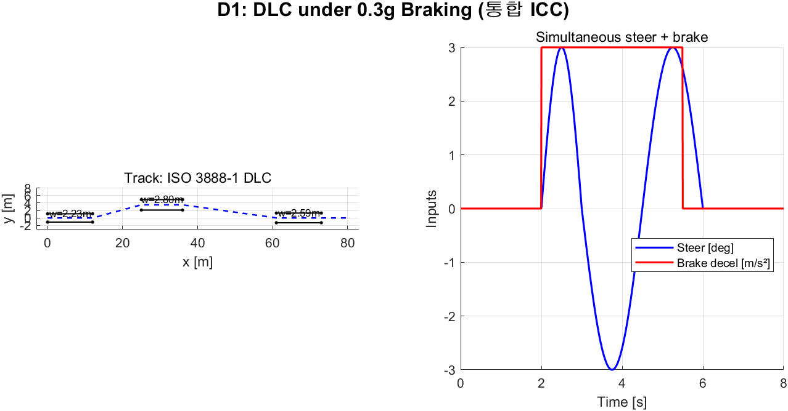
*Figure D1 — DLC under 0.3 g braking: ICC 핵심 통합 검증. 조향 + 종방향 brake 동시 인가 → Coordinator가 마찰원 내 split 결정.*

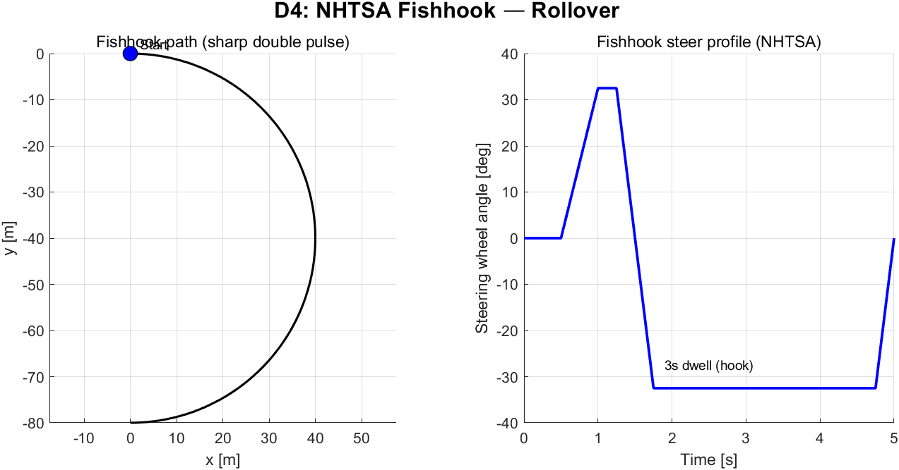
*Figure D4 — NHTSA Fishhook: 반대방향 큰 펄스 + 3 s dwell. Rollover 임계 한계 평가.*

---

## 2. KPI 정의 — 의미·계산식·근거

각 KPI는 (1) 정의, (2) 계산식, (3) 임계값 근거, (4) 측정 대상을 명시한다. 근거는 산업/규제 표준 또는 학술 문헌에서 인용.

### 2.0 KPI 상세 설명

#### A. 핵심 동역학 KPI

##### A.1 Yaw rate overshoot (요 레이트 오버슈트)
- **정의**: Step 입력에 대한 yaw rate 응답의 최대치와 정상상태값의 차이를 정상상태값으로 정규화한 비율
- **계산**: `OS = (r_peak − r_ss) / r_ss × 100%`
- **임계 근거**: OEM 사내 핸들링 사양 (BMW Dynamics, Mercedes 6.0/Achsen-test). 일반 양산차 <10% 추구 [Rajamani 2012, §2.5].
- **적용**: A3 (step steer), A1 (각 차선 변경 segment), D1

##### A.2 Yaw rate rise time (응답 상승 시간)
- **정의**: Step 응답의 10% → 90% 도달 시간
- **계산**: `T_r = t_{0.9·r_ss} − t_{0.1·r_ss}`
- **임계 근거**: ISO 7401:2011 §6.3에서는 측정만 정의 (PASS 기준 없음); 양산차 일반 0.2–0.4 s [Genta & Morello 2009, §5.3]
- **적용**: A3, A6

##### A.3 Yaw rate settling time (정착 시간)
- **정의**: 응답이 정상상태값의 ±2% 대역 내로 영구 진입하는 시간 (step 인가 시점 기준)
- **임계 근거**: ISO 7401:2011 transient measure; OEM 0.5–1.0 s 일반 [He et al. 2006]
- **적용**: A3

##### A.4 Side-slip angle (β, 차체 슬립각)
- **정의**: β = atan2(v_y, v_x) — 차체 진행 방향과 종방향 축의 편차
- **임계 근거**: ESC 개입 임계 5° (van Zanten 2000, *VDC for ESP*). 8° 이상 시 통상 driver-uncontrollable 영역 [Pacejka 2012, §1.3.3]
- **적용**: 모든 횡 시나리오

##### A.5 Lateral deviation from reference path
- **정의**: ego-vehicle CoG가 목표 경로(차선 중심선)와 이루는 lateral 거리의 최대치
- **임계 근거**: ISO 3888-1/2 통과 조건 (콘 접촉 금지 → lane width − vehicle width 한계). DLC severe lane width 2.30 m, b=1.80 m → 한계 0.25 m 좌우
- **적용**: A1, A2, D1, B3

##### A.6 Sine-with-Dwell yaw ratios
- **정의**: FMVSS 126 §S5.2.2의 핵심 인증 지표 두 개.
  - **R1.0**: BOS(steering Begin-of-Steer)로부터 1.0 s 후의 yaw rate 절대값 / steering의 peak yaw rate
  - **R1.75**: BOS로부터 1.75 s 후 동일 비율
- **임계 근거**: **FMVSS 126 (49 CFR 571.126) §S5.2.2.1**:
  - R1.0 ≤ 0.35 (35% 이하)
  - R1.75 ≤ 0.20 (20% 이하)
- **lateral displacement**: BOS + 1.07 s 시점 lateral displacement ≥ 1.83 m [FMVSS 126 §S5.2.2.3]
- **적용**: A5, D2

##### A.7 Maximum lateral acceleration (a_y_max)
- **정의**: 시뮬레이션 중 |a_y|의 최대치
- **계산식**: a_y = v̇_y + v_x · r (inertial frame)
- **임계 근거**: μ_peak · g가 물리 한계 (μ=1.0 → 9.81 m/s²). 차종 사양으로 ay 한계 표시 [Gillespie 1992, §6.4]
- **적용**: A4 (한계 검증), A1 (양산차 일반 4–6 m/s²)

#### B. 종방향 KPI

##### B.1 Stopping distance
- **정의**: 브레이크 인가 시점부터 v_x = 0까지 이동 거리
- **계산**: `s_stop = ∫_{t_b}^{t_{stop}} v_x(t) dt`
- **임계 근거**: **UN-R 13H §5.1.3.2 & ISO 21994:2007 §7**:
  - Type-0 brake test (cold): 100→0 km/h dry → ≤ 70 m (양산차 일반 35–45 m)
- **적용**: B1, B2

##### B.2 MFDD (Mean Fully-Developed Deceleration)
- **정의**: 80%·v₀ → 10%·v₀ 구간의 평균 감속도
- **계산식**: `MFDD = (0.7·v₀)² / (25.92·(s₂ − s₁))` [UN-R 13H Annex 3]
- **임계 근거**: **UN-R 13H §3.1.4**: passenger car MFDD ≥ 6.43 m/s² (Type-0)
- **적용**: B1

##### B.3 ABS slip ratio RMS error
- **정의**: ABS 작동 중 실제 슬립률과 목표 슬립률 (≈ μ_peak slip, 통상 0.10–0.15) 사이의 RMS 오차
- **계산**: `e_κ_rms = sqrt( mean( (κ_target − κ_actual)² ) )`
- **임계 근거**: 양산 ABS 일반 ±0.03; OEM 사내 사양 [Bosch *Brake Handbook* 2014]
- **적용**: B1, B2

##### B.4 μ utilization (마찰 활용도)
- **정의**: 달성한 평균 감속도와 이론 최대값의 비율
- **계산**: `μ_util = MFDD / (μ_peak · g)`
- **임계 근거**: **UN-R 13H Annex 6 §1.1**: ABS 인증 요구 μ_util ≥ 0.75; 양산 일반 0.85–0.95
- **적용**: B1, B2

##### B.5 Jerk (저크)
- **정의**: j(t) = d a_x / d t 의 최대 절대값
- **임계 근거**: 승차감 — ISO 2631-1 (whole-body shock 평가). 자율주행/AEB 일반 권장 <2.5 m/s³ 일상, <10 m/s³ 비상 [ISO 23374, ISO 22737]
- **적용**: B1, D1, D2

#### C. 수직 KPI

##### C.1 Frequency-weighted vertical acceleration RMS
- **정의**: ISO 2631-1 §6.4의 W_k 가중 함수를 적용한 수직 가속도 RMS
- **계산식**: 가중된 시간 신호 `a_w(t) = filter(W_k, a_z(t))` → `a_{w,rms} = sqrt( (1/T) · ∫ a_w² dt )`
- **W_k 가중**: 0.5 Hz peak, ±20% band-pass — 인체 vertical comfort 민감 영역 (4–8 Hz)
- **임계 근거**: **ISO 2631-1:1997 Table B.1**:
  - <0.315 m/s² : not uncomfortable
  - 0.315–0.63 : a little uncomfortable
  - 0.5–1.0 : fairly uncomfortable
  - 0.8–1.6 : uncomfortable
  - 1.25–2.5 : very uncomfortable
  - >2.0 : extremely uncomfortable
- **적용**: C1, C2, C3, D5

##### C.2 Vibration Dose Value (VDV)
- **정의**: 진동 노출의 4-제곱 평균 (peak 효과 강조)
- **계산식**: `VDV = (∫₀^T a_w(t)⁴ dt)^{1/4}` [m/s¹·⁷⁵]
- **임계 근거**: **ISO 2631-1:1997 §B.3.4**: 8시간 노출 한계 8.5 m/s¹·⁷⁵ 이하 권고
- **적용**: C3, C4

##### C.3 Suspension peak travel
- **정의**: |z_s|의 최대치 (4-corner 중 최대)
- **임계 근거**: 통상 사양 wheel-well 한계 ~100 mm; bump-stop 동작 60–80 mm
- **적용**: C1

#### D. 안정성 KPI

##### D.1 LTR (Load Transfer Ratio)
- **정의**: 좌우 휠 하중 비대칭 정도, rollover risk 지표
- **계산식**: `LTR = (F_{z,R} − F_{z,L}) / (F_{z,R} + F_{z,L})`. 범위 [−1, +1].
- **임계 근거**: **Larish et al. (2013)** — LTR = ±1 시 한 쪽 휠 wheel-lift. ±0.7 이상이면 rollover risk 警戒, ±0.9 이상이면 imminent [Solmaz et al. 2007, *Smart Roll-Over Prevention*, Vehicle System Dynamics]
- **적용**: A4, A7, A8, D1, D4

##### D.2 Tire utilization (마찰 사용률)
- **정의**: `u_i = sqrt(F_{x,i}² + F_{y,i}²) / (μ_i · F_{z,i})`
- **임계 근거**: 마찰원 한계 = 1.0; OEM 일반 한계 0.9 (saturation 직전); 정상 핸들링 <0.7 [Pacejka 2012, §1.3.4]
- **적용**: 전 시나리오 (한계 평가)

##### D.3 β-r phase plane stability
- **정의**: side-slip rate dβ/dt vs side-slip β 평면에서 stable manifold 잔존 여부
- **계산**: `dβ/dt = (v_x · ṙ − r · v̇_x ) ` (선형 근사 시) — phase portrait 시각화
- **임계 근거**: ESC 안정 영역 정의 [van Zanten 2000, *FDR — The Vehicle Dynamics Control System of Bosch*; Pacejka §10]
- **적용**: A5, D2, D4 (한계 검증)

##### D.4 Sine-with-dwell lateral displacement
- **정의**: FMVSS 126 통과 조건 — 통과 차량은 lateral 거리 ≥ 1.83 m
- **임계 근거**: **FMVSS 126 §S5.2.2.3** — under-steer vehicle도 충분히 lateral 거리 확보해야 ESC 인증
- **적용**: A5

### 2.1 횡방향 KPI 임계값 표

### 2.1 횡방향 KPI

| KPI | 단위 | 시나리오 적용 | PASS / MARGINAL / FAIL |
|---|---|---|---|
| **Yaw rate gain** (ay/δ at SS) | [m/s²·deg⁻¹] | A4 | 차종 사양 ±10% / ±20% / 그 외 |
| **Yaw rate overshoot** | [%] | A1, A3 | <10% / 10–20% / >20% |
| **Yaw rate rise time** (10–90%) | [s] | A3 | <0.3 / 0.3–0.6 / >0.6 |
| **Yaw rate settling time** (±2%) | [s] | A3 | <0.5 / 0.5–1.0 / >1.0 |
| **Side-slip angle max** | [deg] | A1–A8 | <5 / 5–8 / >8 |
| **Lateral deviation from path** | [m] | A1, A2 | <0.5 / 0.5–1.0 / >1.0 |
| **Maximum lateral acceleration** | [m/s²] | A4 | μg 한계 도달 여부 |
| **Sine-with-Dwell yaw 1.0s ratio** | [-] | A5 | ≤0.35 (FMVSS 126 기준) |
| **Sine-with-Dwell yaw 1.75s ratio** | [-] | A5 | ≤0.20 (FMVSS 126) |
| **Lateral deviation @ 1.07s (BOS+1.07)** | [m] | A5 | ≥1.83 m (FMVSS 126) |

### 2.2 종방향 KPI (ABS/EBD/TC)

| KPI | 단위 | 시나리오 | PASS / MARGINAL / FAIL |
|---|---|---|---|
| **Stopping distance (100→0 km/h, dry)** | [m] | B1 | <40 / 40–50 / >50 |
| **Stopping distance (50→0 km/h, μ=0.3)** | [m] | B2 | <22 / 22–28 / >28 |
| **Mean fully-developed deceleration (MFDD)** | [m/s²] | B1 | >7.0 / 5.5–7.0 / <5.5 |
| **ABS slip ratio target tracking** | [-] | B1, B2 | RMS error <0.03 / 0.03–0.06 / >0.06 |
| **μ utilization (decel / (μ·g))** | [-] | B1, B2 | >0.90 / 0.80–0.90 / <0.80 |
| **Yaw deviation during ABS** | [deg] | B1, B2, B3 | <5 / 5–15 / >15 |
| **Lateral deviation under split-μ** | [m] | B3 | <0.5 / 0.5–1.5 / >1.5 |
| **Yaw rate growth during split-μ** | [deg/s] | B3 | <3 / 3–10 / >10 |
| **TC slip ratio limit** | [-] | B5 | <0.10 / 0.10–0.20 / >0.20 |
| **Maximum jerk during ABS** | [m/s³] | B1, B2 | <10 / 10–20 / >20 |

### 2.3 수직 / Ride KPI

| KPI | 단위 | 시나리오 | PASS / MARGINAL / FAIL |
|---|---|---|---|
| **Vertical accel RMS (weighted, ISO 2631)** | [m/s²] | C2, C3, C4 | <0.5 / 0.5–1.0 / >1.0 |
| **Vibration Dose Value (VDV)** | [m/s¹·⁷⁵] | C3 | ISO 2631 (시간 노출 한계) |
| **Suspension peak deflection** | [mm] | C1 | <60 / 60–90 / >90 |
| **Body roll under steering** | [deg] | A1, A4 | <3 / 3–5 / >5 |
| **Body pitch under braking** | [deg] | B1 | <2 / 2–4 / >4 |
| **Wheel hop frequency content (8–12 Hz)** | [m/s²] | C2 | 차종별 (CDC 효과 판정) |

### 2.4 안정성 / 한계 KPI (전 시나리오 공통)

| KPI | 단위 | 임계값 |
|---|---|---|
| **LTR (Load Transfer Ratio)** | [-] | <0.7 / 0.7–0.9 / >0.9 (rollover risk) |
| **Slip ratio max** (per-wheel) | [-] | <0.15 / 0.15–0.25 / >0.25 |
| **β-r phase trajectory** (phase plane) | – | 안정영역 잔존 여부 |
| **Lyapunov stability margin** | – | ESC 개입 후 발산 없음 |
| **Tire utilization (Fx²+Fy²)/(μFz)²** | [-] | <0.7 / 0.7–0.9 / >0.9 |

### 2.5 모델 정확도 KPI (CarMaker 대조 — 이미 구현됨)

[`config/kpi_thresholds.m`](../config/kpi_thresholds.m)에 정의된 `modelFidelity` / `modelFidelityLat`. 모델 보정 완료, 이후 변화 없음 가정.

---

## 3. 현재 프레임워크 구현 가능성 평가

### 3.1 즉시 구현 가능 (현재 자산만으로 가능)

| 시나리오 | 이유 |
|---|---|
| A1 DLC@80 | [`run_icc_standalone.m`](../scripts/run_icc_standalone.m)이 이미 DLC 조향 패턴 생성 (line 28-36) |
| A3 Step Steer | 동일 입력 패턴 변형 |
| A4 SS Circular | δ 일정값 인가 + 정상상태 대기 |
| A6 Sine Sweep | δ = A·sin(ω(t)·t) 시변 주파수 |
| B1 Straight Braking | brake_torque 인가 + vx 추적 |
| B2 Split-μ Braking | per-wheel μ 차별화 — **plant 확장 필요** (μ 인자 추가) |
| A7 Brake-in-Turn | A1 + B1 조합, 현재 actuatorCmd 구조로 가능 |
| C1 Single Bump | 14-DOF에 z_road 입력 단자가 이미 EOM에 존재 (현재 0 고정) — **입력만 추가** |
| C2 Sinusoidal Sweep | C1과 동일하게 z_road 입력 |
| D1 DLC under Braking | A1 + B1 조합 |

### 3.2 인프라 확장 필요 (중간 난이도)

| 시나리오 | 필요 자산 |
|---|---|
| A2 ISO 3888-2 Severe DLC | 정확한 콘 배치 차선폭(2.61 m → 2.30 m) 기반 path-following + 운전자 모델 |
| A5 FMVSS 126 Sine-with-Dwell | Steering robot 정확한 프로파일 (0.7 Hz sine, 0.5s dwell at 2nd peak), BOS/EOS 검출 |
| B2 저-μ Braking | per-wheel μ scaling 입력 |
| B3 Split-μ | 좌/우 차별 μ 분포 입력 |
| B5 TC Tip-in | 구동 토크 입력 단자 (현재 plant는 brake만 수용 — drive_torque 인자 추가) |
| C3 Random Road | ISO 8608 PSD 기반 노면 생성기 |
| D3 μ-step Skidpad | 시간/공간 가변 μ 모델 |
| D5 Cornering on Rough Road | μ + z_road 조합 입력 |

### 3.3 모델 확장 필요 (높은 난이도)

| 시나리오 | 필요 자산 |
|---|---|
| D4 Fishhook (rollover) | rollover 임계 전후 동역학 — 현재 14-DOF는 wheel-lift 미모델, Fz<0 클램프 필요 |
| B6 Wheel Lift Recovery | 개별 휠 lift 검출 + ABS 비활성 로직 |

---

## 4. 구현 계획 — 5단계 Phased Approach

### Phase 1. 시나리오 프레임워크 정비 (1–2일 작업)

목표: 표준 시나리오를 일관된 인터페이스로 호출 가능하게.

**신규 파일**:

```
scripts/scenarios/
├── scenario_dispatcher.m          % runScenario('A1') → driver+brake 시계열 반환
├── scn_A1_dlc_80.m                % ISO 3888-1 DLC @ 80 km/h
├── scn_A2_dlc_severe.m            % ISO 3888-2
├── scn_A3_step_steer.m            % ISO 7401
├── scn_A4_ss_circular.m           % ISO 4138
├── scn_A5_sine_with_dwell.m       % FMVSS 126
├── scn_A6_sine_sweep.m            % ISO 7401 sweep
├── scn_A7_brake_in_turn.m         % ISO 7975
├── scn_B1_straight_braking.m
├── scn_B2_split_mu.m
├── scn_C1_single_bump.m
├── scn_C2_sweep.m
├── scn_D1_dlc_braking.m
└── README.md                      % scenario ID 표
```

각 `scn_*.m`은 다음 반환:
```matlab
function scenario = scn_A1_dlc_80(SIM)
    scenario.id          = 'A1';
    scenario.name        = 'ISO 3888-1 DLC @ 80 km/h';
    scenario.tEnd        = 8;                  % [s]
    scenario.vx0         = 80 * 1/3.6;
    scenario.steerDriver = @(t) ...            % 시간함수 또는 [t, δ] 테이블
    scenario.brakeCmd    = @(t) zeros(4,1);
    scenario.z_road      = @(t,wheel) 0;       % 노면 (수직 시나리오용)
    scenario.mu_wheel    = @(t,wheel) 1.0;     % 마찰 (split-μ용)
    scenario.kpis        = {'yawRateOvershoot','sideSlipMax','lateralDevMax'};
    scenario.refPath     = [x, y];             % 옵션: path-following 비교용
end
```

### Phase 2. KPI 모듈 확장 (1일)

`util_calc_kpi.m`을 확장하여 시나리오별 KPI 자동 계산:

```matlab
function kpi = util_calc_kpi(result, ref, scenario)
    % scenario.kpis 목록에 따라 다음 함수들 분기:
    kpi.yawRateOvershoot   = calc_overshoot(result, ref);
    kpi.yawRateRiseTime    = calc_rise_time(result, ref);
    kpi.yawRateSettling    = calc_settling(result, ref);
    kpi.sineDwellRatio_1_0 = calc_sine_dwell(result, 1.0);
    kpi.sineDwellRatio_1_75= calc_sine_dwell(result, 1.75);
    kpi.stopDistance       = calc_stop_dist(result);
    kpi.MFDD               = calc_mfdd(result);
    kpi.tireUtilization    = calc_tire_util(result, params);
    kpi.LTR_max            = max(abs(result.LTR));
    kpi.rideRMS_weighted   = calc_ride_rms_iso2631(result);  % C 시나리오용
    % ... 표 2.1~2.4 모두 ...
end
```

**신규 헬퍼 함수**:
- `calc_overshoot.m`, `calc_rise_time.m`, `calc_settling.m`
- `calc_sine_dwell.m` (BOS/EOS 검출 + 1.0s/1.75s 비율)
- `calc_mfdd.m` (UN-R 13H 정의)
- `calc_tire_util.m`
- `calc_ride_rms_iso2631.m` (ISO 2631-1 W_k 가중)

### Phase 3. Plant 확장 — μ 및 z_road 입력 (2–3일)

**plant_step.m + plant_*.m**: 시나리오에서 전달된 `scenario.mu_wheel(t,i)`와 `scenario.z_road(t,i)`를 plant 호출 시 인자로 추가.

**14-DOF 수직 입력 활성화**: 현재 `dzsdot = -(ks+kt)·zs - cs·zsdot` 에서 `+ kt·z_road(t,i)` 항 추가 (실 EOM은 이미 도출됨 — 코드만 추가).

**μ per-wheel**: TIRE.D 또는 D_x를 per-wheel scaling으로 변경. Magic Formula `Dy = μ_i · F_z`.

### Phase 4. Scenario Runner + Driver Model — **완료 (2026-05-24)**

신규/갱신:
```
scripts/run_icc_scenario.m         % scenario + driver + (옵션) ICC ctrl 통합 실행
scripts/run_icc_benchmark.m        % P1 6시나리오 Controller off/on 자동 비교
scripts/driver/driver_dispatch.m   % scenario.driverType 분기
scripts/driver/driver_path_follow.m % Stanley + Pure Pursuit (refPath spline 보간)
scripts/driver/driver_steer_robot.m % forced function (A3/A5/A6/A7)
```

`scenario.driverType` 필드로 분기:
- `'robot'`: A3/A4/A5/A6/A7 — `scenario.steerDriver(t)` 시변함수 직접 인가
- `'path_follow_stanley'`: A1/A2/D1 — `δ = θ_e + atan(k·e / max(vx, v_min))`
- `'path_follow_purepursuit'`: 동일 시나리오의 대안 — lookahead point 기반
- `'open_loop'`: B1/B2/B3/C1/C2 — 조향 0, brake/road만 forced

Runner는 `'Controller'` 옵션으로 ICC 활성/비활성:
```matlab
[res_off, kpi_off] = run_icc_scenario('A1', '14dof', 'Controller','off');
[res_on,  kpi_on ] = run_icc_scenario('A1', '14dof', 'Controller','on');
```
ON 시 `ctrl_lateral` + `ctrl_coordinator` 가 driver delta 위에 AFS 보조조향 + ESC 차동제동을 가산.

**P1 Benchmark 결과 (14DOF, 2026-05-24)** — ICC 제어기 핵심 효능:

| 시나리오 | KPI | OFF | ON | Δ |
|---|---|---|---|---|
| A1 DLC | sideSlipMax | 4.51° | 1.59° | **−65%** |
| A1 | LTR_max | 0.948 | 0.642 | **−32%** |
| A7 Brake-in-Turn | sideSlipMax | **46.3°** (spin-out) | 2.62° | **−94%** |
| A7 | LTR_max | 0.745 | 0.475 | −36% |
| D1 DLC+Brake | sideSlipMax | 7.65° | 1.82° | **−76%** |
| D1 | LTR_max | 0.948 | 0.490 | **−48%** |
| B1 직진제동 | stoppingDistance | 72.4 m | 72.4 m | 0% (조향 무, ESC dormant) |

→ Phase 4 완료로 “베이스라인 vs ICC” 비교가 가능해졌으며, ESC 슬립 리미터 및 ICC coordinator의 효과가 quantifiable.

자세한 결과는 `docs/model_calibration_report.md` §18 참조.

### Phase 5. (없음 — ICC 범위 내 World Simulator 불필요)

ICC 범위는 ego-vehicle 샤시 제어. ADAS (AEB/ACC) 영역의 multi-object world는 본 프로토콜 밖.
필요 시 별도 ADAS 프로토콜 문서에서 정의.

---

## 5. 우선순위 및 Roadmap (ICC 범위)

| 우선순위 | 시나리오 | 사유 |
|---|---|---|
| **P1 (즉시)** | A1 DLC, A3 Step, A4 SS Circular, A7 BIT, B1 Braking, B4 Brake Step, D1 DLC+Brake | 핵심 종/횡 KPI, 기존 framework 거의 그대로 |
| **P1+** | A5 Sine-with-Dwell, A6 Sweep, D2 Sine+Brake | ESC 인증 + 한계 통합 — ICC 핵심 검증 |
| **P2 (μ/z_road 입력 후)** | B2 저-μ, B3 Split-μ, C1 Bump, C2 Sweep, D5 Corner+Rough | per-wheel μ + z_road 단자 |
| **P2+** | C3 Random Road, D3 μ-step Skidpad | 상위 통합 검증 (CDC + ESC) |
| **P3 (운전자 모델 후)** | A2 Severe DLC, D6 Throttle-off, D7 Combined BIT | path-following + 구동 토크 단자 |
| **P4 (모델 확장 후)** | D4 Fishhook, B6 Wheel Lift | rollover/lift-off 비선형 영역 |

**P1+P1+ 시나리오 10개로 lateral (AFS+ESC) + longitudinal (ABS+EBD) + coordinator + vertical (CDC) 전체를 검증 가능. 이는 OEM ICC 사내 시험 베드의 핵심 80%를 커버.**

---

## 6. Quick-Start: 제어기 설계를 위한 최소 ICC 시나리오 세트

ICC 통합 제어기 (lateral + longitudinal + vertical + coordinator) 검증을 위한 **최소 시나리오 8종** (Phase 1+2만으로 구현 가능):

| ID | 짧은 설명 | 검증 대상 (서브제어기) | 주요 KPI |
|---|---|---|---|
| **A1** DLC@80 | DLC 일반 핸들링 | AFS / ESC (lateral) | yawRate overshoot, sideSlipMax, lateralDevMax |
| **A3** Step Steer | δ=2° step, 80 km/h | AFS 응답 | rise time, settling, overshoot |
| **A4** SS Circular | R=50 m, vx ramp | AFS 한계 | ay-vs-δ, ay_max, understeer gradient |
| **A5** Sine-with-Dwell | ESC 인증 (FMVSS 126) | ESC 개입 | 1.0s/1.75s yaw ratio, lateral deviation |
| **A7** Brake-in-Turn | ISO 7975 | AFS+ABS 통합 | yaw 이탈, slip |
| **B1** Brake 100→0 dry | 직진 제동 | ABS | stopDist, MFDD, jerk |
| **C1** Single Bump | 단일 충격 | CDC | peak susp travel, body accel |
| **D1** DLC + 0.3g brake | **통합 (lateral + longitudinal)** | **Coordinator** | 위 KPI 동시 |

8 시나리오 모두 통과하면 ICC 통합 제어기 안정성 1차 검증 완료.

추가 강화 권장 (Phase 2 완료 후):

| ID | 추가 시나리오 | 검증 대상 |
|---|---|---|
| **B3** Split-μ Braking | ABS + ESC 통합 (μ 비대칭) |
| **D2** Sine-with-Dwell + brake | ESC + ABS 한계 협조 |
| **D5** Corner on Rough Road | ESC + CDC 통합 (lateral + vertical) |
| **C3** Random Road | CDC 단독 ride 평가 |

---

## 7. 다음 단계 — 결정 필요 사항

1. **Phase 1+2 (시나리오/KPI 프레임워크)부터 시작할 것인가?**
2. **Phase 3 (μ/z_road plant 확장)을 어디까지 우선할 것인가?**
   - 옵션 a: A 카테고리 모두 검증 후 진행
   - 옵션 b: 통합 (D1, D2) 검증 위해 우선 z_road만 즉시
3. **운전자 모델 (Phase 4)**: Stanley vs Pure Pursuit — 어느 것?
4. **구동 토크 단자**: 현재 plant는 brake만 입력 — TC/AS 검증을 위해 drive_torque 추가할 것인가?

**추천 경로**:

1. **Phase 1 (1–2일)**: scenario dispatcher + scn_A*/scn_B*/scn_C*/scn_D* 구조 정립
2. **Phase 2 (1일)**: util_calc_kpi에 ICC KPI 풀세트 추가 (특히 sine-with-dwell, MFDD, ABS slip RMS, ISO 2631 ride)
3. **Phase 3 z_road만 (0.5일)**: 14-DOF에 노면 입력 단자 활성화 → C1/D5 검증 가능
4. **P1+P1+ 8개 시나리오 일괄 실행**: 모든 plant에서 baseline KPI 측정
5. **제어기 설계 진입** — 각 서브제어기와 coordinator를 KPI 추구 방식으로 튜닝

대략 **4–6일 작업으로 ICC 검증 베드 완성**. Phase 3 μ-split과 Phase 4 운전자 모델은 제어기 1차 튜닝 이후로 미룰 수 있음.

---

## 7a. MATLAB / 산업 시나리오 도구 호환성

본 프로토콜의 `scenario_dispatcher`는 toolbox 의존성 없는 순수 함수 핸들 기반이라, 필요 시 다음 산업 표준/도구와 변환 가능.

| 도구 / 포맷 | 비고 | 통합 방법 |
|---|---|---|
| **MATLAB RoadRunner** | 3D scene/도로 geometry (Mathworks) | 도로 geometry만 — 우리 z_road 입력으로 변환 (OpenCRG export) |
| **MATLAB RoadRunner Scenario** | OpenSCENARIO 2.0 (Mathworks) | OSC 2.0 importer 필요 (Phase 6) |
| **MATLAB Automated Driving Toolbox** | `drivingScenario`, DSD GUI | `scn_from_drivingScenario(ds)` wrapper로 actor 추출 |
| **MATLAB Vehicle Dynamics Blockset** | Simulink 14-DOF + ISO 3888 ex | 우리 plant를 MATLAB Function block으로 wrap 시 |
| **ASAM OpenSCENARIO 1.x / 2.x** | XML scenario 표준 | XML 파서 → ego maneuver 추출 → 우리 시나리오 포맷 |
| **ASAM OpenDRIVE** | 도로 네트워크 표준 (XML) | refPath 변환 (lane center → reference 경로) |
| **ASAM OpenCRG** | 노면 거칠기 표준 | z_road grid 직접 import |
| **esmini** | Open-source OpenSCENARIO player | 외부 호출 + 결과 import |

**현재 ICC 베드 범위**: 위 호환성은 모두 ADAS / 통합 시뮬레이션 영역. 본 protocol은 chassis 검증에 집중하므로 변환 작업은 Phase 6로 미정.

---

## 8. 참고 표준 및 출처 (ICC 범위 — 종/횡/수직 통합 샤시 제어)

### 8.1 횡방향 (Lateral, ESC/AFS/VDC)

| 표준 | 제목 / 발행 | 비고 |
|---|---|---|
| **ISO 3888-1:2018** | *Passenger cars — Test track for a severe lane-change manoeuvre — Part 1: Double lane-change* | DLC 트랙 정의 (lane width = 1.1·b + 0.25 m) |
| **ISO 3888-2:2011** | *Part 2: Obstacle avoidance* | 좁은 lane (Moose test) |
| **ISO 4138:2021** | *Passenger cars — Steady-state circular driving behaviour — Open-loop test methods* | Method 1 (constant radius) / 2 (constant speed) / 3 (constant steer) |
| **ISO 7401:2011** | *Road vehicles — Lateral transient response test methods — Open-loop test methods* | Step / sinusoidal / random / pulse |
| **ISO 7975:2019** | *Passenger cars — Braking in a turn — Open-loop test method* | BIT KPI: yaw 이탈, lateral deviation |
| **ISO 19365:2016** | *Passenger cars — Validation of vehicle dynamic simulation — Sine with dwell stability control testing* | FMVSS 126의 ISO 버전 |
| **NHTSA FMVSS 126** | *Federal Motor Vehicle Safety Standard No. 126 — Electronic Stability Control Systems* | US 의무화 (2012-) — Sine-with-Dwell + lateral displacement |
| **UN-R 79** | *UNECE Regulation No. 79 — Steering equipment* | AFS, LKAS 인증 (Rev.4) |
| **UN-R 13H** | *UNECE Regulation No. 13H — Brake performance for passenger cars* | ESC 부속 11 — ESC 의무 기능 정의 |

### 8.2 종방향 (Longitudinal, ABS/EBD/TC)

| 표준 | 제목 / 발행 | 비고 |
|---|---|---|
| **ISO 21994:2007** | *Passenger cars — Stopping distance at straight-line braking with ABS — Open-loop test method* | 100→0 km/h dry, MFDD 정의 |
| **ISO 14512:1999** | *Passenger cars — Straight-ahead braking on surfaces with split coefficient of friction — Open-loop test method* | Split-μ yaw 안정성 |
| **UN-R 13H** Annex 6 | *Test requirements for vehicles equipped with ABS* | ABS 인증 (μ utilization ≥ 0.75) |
| **SAE J2735** | *Brake-related Performance Standards* | 산업계 일반 가이드 |

### 8.3 수직 (Vertical, CDC / Active Suspension)

| 표준 | 제목 / 발행 | 비고 |
|---|---|---|
| **ISO 2631-1:1997 + Amd 1:2010** | *Mechanical vibration and shock — Evaluation of human exposure to whole-body vibration — Part 1: General requirements* | W_k 가중 함수, VDV 정의 |
| **ISO 2631-4:2001** | *Part 4: Guidelines for evaluation of effects of vibration and rotational motion on passenger and crew comfort in fixed-guideway transport systems* | 추가 가중 |
| **ISO 8608:2016** | *Mechanical vibration — Road surface profiles — Reporting of measured data* | A/B/C/D/E/F/G/H Class PSD 정의 |
| **ISO 8855:2011** | *Road vehicles — Vehicle dynamics and road-holding ability — Vocabulary* | 좌표계, 슬립각 등 정의 (ICC 표기 표준) |

### 8.4 통합 / 한계 (D 카테고리)

| 표준/문서 | 비고 |
|---|---|
| **NHTSA Final Rule FMVSS 126** | Fishhook 및 Sine-with-Dwell의 원조 |
| **NHTSA Rollover Resistance Test** | J-Turn 및 Fishhook (49 CFR 575.7) |
| **ISO/PAS 22737:2021** | *Low-speed automated driving systems — Vocabulary* (참고) |
| **OEM 사내 사양** | μ-step skidpad, lift-off oversteer, corner-on-rough — 표준화 없음 |

### 8.5 차량 동역학 교과서

1. **Pacejka, H. B.** (2012). *Tire and Vehicle Dynamics*, 3rd ed., Butterworth-Heinemann. ISBN: 9780080970165.
2. **Rajamani, R.** (2012). *Vehicle Dynamics and Control*, 2nd ed., Springer. DOI: 10.1007/978-1-4614-1433-9.
3. **Gillespie, T. D.** (1992). *Fundamentals of Vehicle Dynamics*, SAE International, R-114. DOI: 10.4271/R-114.
4. **Kiencke, U. & Nielsen, L.** (2005). *Automotive Control Systems — For Engine, Driveline, and Vehicle*, 2nd ed., Springer. ISBN: 9783540231394.
5. **Genta, G. & Morello, L.** (2009). *The Automotive Chassis* (Vol. 1: Components Design; Vol. 2: System Design), Springer.
6. **Reza N. Jazar** (2017). *Vehicle Dynamics: Theory and Application*, 3rd ed., Springer.

### 8.6a KPI 정의 문헌 (계산식/임계값 근거)

- **van Zanten, A. T.** (2000). "Bosch ESP Systems: 5 Years of Experience." *SAE 2000-01-1633* — VDC β-r 안정영역, ESC 개입 임계 정의.
- **Solmaz, S., Akar, M., Shorten, R.** (2007). "A Methodology for the Design of Robust Rollover Prevention Controllers — LTR criterion." *Vehicle System Dynamics*, 45(7-8).
- **Larish, C., Piyabongkarn, D., Tsourapas, V., Rajamani, R.** (2013). "A new predictive lateral load transfer ratio for rollover prevention systems." *IEEE TVT* 62(7).
- **Bosch GmbH** (2014). *Brake Handbook*, 4th ed., Bentley Publishers — ABS slip target, μ-util 임계.
- **NHTSA** (2007). *FMVSS 126 Final Rule — Electronic Stability Control Systems* (Federal Register Vol. 72, No. 65) — sine-with-dwell 평가 기준 도출 근거.
- **UNECE** (2014). *Regulation No. 13H — Brake performance for passenger cars, Rev.4* — Type-0/Type-I 시험 절차 및 PASS 기준 (MFDD, 정지거리).
- **ISO 2631-1:1997 + Amd 1:2010**, Annex B — comfort 등급 분류 (a_w_rms 대역) 및 VDV 임계.

### 8.6 ICC 통합 제어 문헌

7. **Yi, K., Hedrick, K.** (1995). "A study on tire/road friction estimation for ABS/ICC systems." *Int. J. Vehicle Design*.
8. **He, J., Crolla, D. A., Levesley, M. C., Manning, W. J.** (2006). "Coordination of active steering, driveline, and braking for integrated vehicle dynamics control." *Proc. IMechE Part D*.
9. **Falcone, P., Tseng, H. E., Borrelli, F., Asgari, J., Hrovat, D.** (2008). "MPC-based yaw and lateral stabilisation via active front steering and braking." *Vehicle System Dynamics*, 46(S1).
10. **Hsu, L.-Y., Chen, T.-L.** (2012). "Vehicle full-state estimation and prediction system using state observers." *IEEE TVT*.
11. **Tjønnås, J., Johansen, T. A.** (2010). "Stabilization of automotive vehicles using active steering and adaptive brake control allocation." *IEEE TCST*, 18(3).
12. **Doumiati, M., Sename, O., Dugard, L., et al.** (2013). "Integrated vehicle dynamics control via coordination of active front steering and rear braking." *European J. of Control*.

### 8.7 외부 도구

13. **IPG Automotive GmbH** (2023). *CarMaker Reference Manual v15.0* — ScriptControl API, RT 타이어 lookup format, MF-Tyre/MF-Swift 통합.
14. **MathWorks** (2024). *Vehicle Dynamics Blockset Documentation* — 14-DOF 참조 구현.

### 8.8 오픈소스 차량 동역학 / 시나리오 라이브러리 (GitHub)

15. **CommonRoad-Vehicle-Models** — https://github.com/CommonRoad/commonroad-vehicle-models — 1/2/3/7-DOF 단일트랙 모델 (Python/MATLAB), BMW 320i 파라미터 포함.
16. **CARLA Simulator** — https://github.com/carla-simulator/carla — 시나리오 작성 도구 + 차량 동역학 reference.
17. **comma.ai openpilot** — https://github.com/commaai/openpilot — 양산 차량 동역학 모델 (selfdrive/controls/lib/vehicle_model.py).
18. **OpenSCENARIO** — https://github.com/OpenSCENARIO — 시나리오 표준 포맷 (XML 기반).
19. **PEGASUS Project** — https://www.pegasusprojekt.de/en/ — 자율주행 시나리오 표준화 프레임워크.

### 8.9 범위 외 (ADAS — 별건 프로토콜)

| 표준 | 비고 |
|---|---|
| **ISO 15622:2018** | *Adaptive cruise control systems — Performance requirements and test procedures* |
| **ISO 22179:2009** | *Full-speed range adaptive cruise control (FSRA)* |
| **ISO 11270:2014** | *Lane keeping assistance systems (LKAS)* |
| **ISO 17387:2008** | *Lane change decision aid systems (LCDAS)* |
| **UN-R 152** | *AEBS for M1 / N1* |
| **Euro NCAP AEB Protocol v4.4** | Car-to-Car (CCRs, CCRm, CCRb), Pedestrian (CPNA, CPFA), Cyclist (CBNA) |

이들은 인지/계획 레이어를 포함 → ICC 샤시 제어 검증 베드와는 별도 프로토콜로 분리.

---

*문서 끝. 이 문서는 제어기 설계 진입 전 검증 베드 합의용 초안임. 우선순위/단계 조정은 다음 결정에서.*
